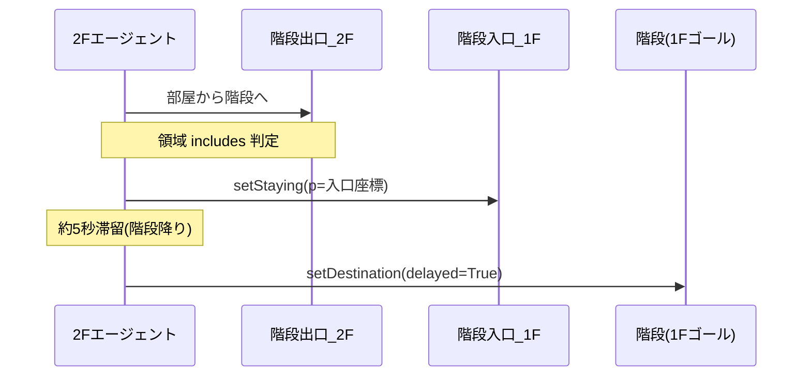

# s4 — 2F→1F 階段ワープ（saya モデル用）

名工大・打矢研の階段混雑避難シミュレーション（S-quattro ミクロ人流）向けに、**2階から1階への階段ワープ**をレイヤー名ベースで実装したコードです。

## レイヤー構成（確定）

| レイヤー名 | 階 | 役割 |
|------------|-----|------|
| `部屋` | 両階共通 | 人流の始点・終点（部屋） |
| `階段出口_2F` | 2F のみ | 2F 階段ゴール。ここに到達したエージェントは 1F へワープ |
| `階段入口_1F` | 1F のみ | 2F から降りてきたエージェントの出現位置（合流点） |
| `階段` | 1F のみ | 1F エージェントが向かう階段ゴール。ワープ後の次の目的地にも使用 |

## ファイル構成

```
psim/stair_warp.py          … ワープ表の構築・ステップ処理（共通ロジック）
snippets/map_init_after.py  … ミクロ人流地図「環境の初期化後の処理」に貼り付け
snippets/agent_step.py      … ミクロ人流エージェント「エージェントのステップ処理」に追記
```

## セットアップ手順

### 1. `stair_warp.py` をプロジェクトに配置

S-quattro プロジェクトフォルダ（例: `saya/data/` やモデルと同じ Python パス）に `psim/stair_warp.py` をコピーするか、プロジェクトルートに `stair_warp.py` として配置してください。

`from stair_warp import ...` が解決できない場合は、ファイルをモデル実行時のカレントディレクトリに置くか、スニペット内の import パスを環境に合わせて変更してください。

### 2. 地図エディタ（レイヤー・領域）

各階段（右下・右上・中央左など）について:

1. **`階段出口_2F`** … 2F 側・階段の奥の経路地点 **1つだけ** を囲む
2. **`階段入口_1F`** … 1F 側・上からの合流点の経路地点 **1つだけ** を囲む
3. **`階段`** … 1F 側・1F エージェントの階段ゴール地点 **1つだけ** を囲む

**推奨**: 対応する3領域すべてに同じ属性 `stair_id` を付ける（例: `BR`, `TR`, `CL`）。  
属性が無い場合は、レイヤー内の領域を座標順に自動ペアリングします（`stair_0`, `stair_1`, …）。

### 3. ミクロ人流地図「環境の初期化後の処理」

`snippets/map_init_after.py` の内容をそのまま貼り付けます。  
`def initAfter(...):` は **書かない** でください（タブ内容がそのまま実行されます）。

初回実行時にログ例:

```
=== [MAP] STAIR_WARPS_2F_1F ===
BR up 39 (...) entrance 51 (...) 1F_goal 60 (...)
...
=== [MAP] STAIR_WARPS_2F_1F END ===
```

### 4. ミクロ人流エージェント「エージェントのステップ処理」

`snippets/agent_step.py` を **既存ステップ処理の末尾** に追記します。

### 5. 人流設定（例）

| 対象 | 始点 | 終点 |
|------|------|------|
| 2F エージェント | `部屋`（2F 側の領域） | `階段出口_2F` |
| 1F エージェント | `部屋`（1F 側の領域） | `階段` |

`proc0`（ランダム経路生成）は使わない構成を推奨します。

## 動作概要



- SFM では `env.setPosition` は使えません。`setStaying(t=..., p=(x,y))` で座標ワープします。
- ワープ後は同一 `stair_id` の **1F `階段`** ノードへ `setDestination` します。
- 各エージェントは `_stair_warped_2f_1f` フラグで二重ワープを防止します。

## パラメータ調整

`map_init_after.py` の `default_stair_time=5.0` を変更すると階段降り時間（秒）を調整できます。

論文どおり速度半分で時間を見積もる場合は、後から `stair_warp.py` の `build_stair_warp_table` 内で距離ベース計算に差し替え可能です。

## トラブルシュート

| 症状 | 確認事項 |
|------|----------|
| ログに `STAIR_WARPS_2F_1F` が空 | レイヤー名の完全一致、`stair_id` の対応、領域内に経路地点があるか |
| ワープしない | エージェント step に `try_stair_warp` が入っているか、2F 側 `階段出口_2F` に入っているか |
| ワープ先がおかしい | initAfter ログの `entrance` 座標が地図上の合流点か |
| import エラー | `stair_warp.py` の配置場所・Python パス |

## ライセンス

研究・シミュレーション用途で自由に利用・改変してください。
